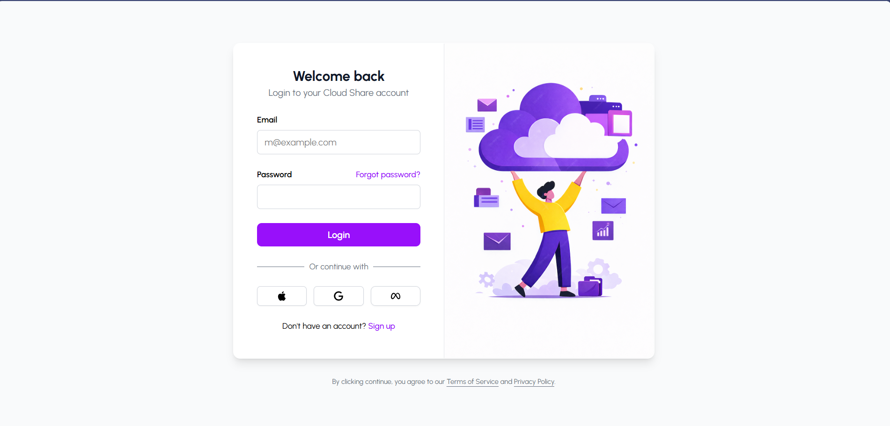
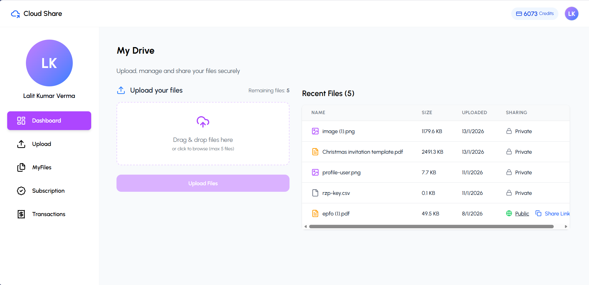
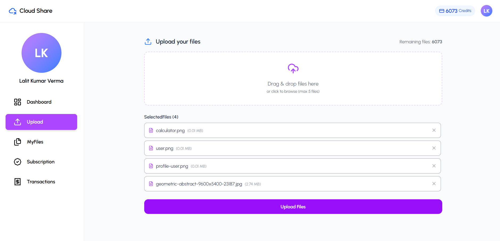
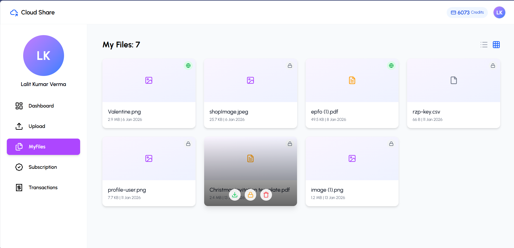
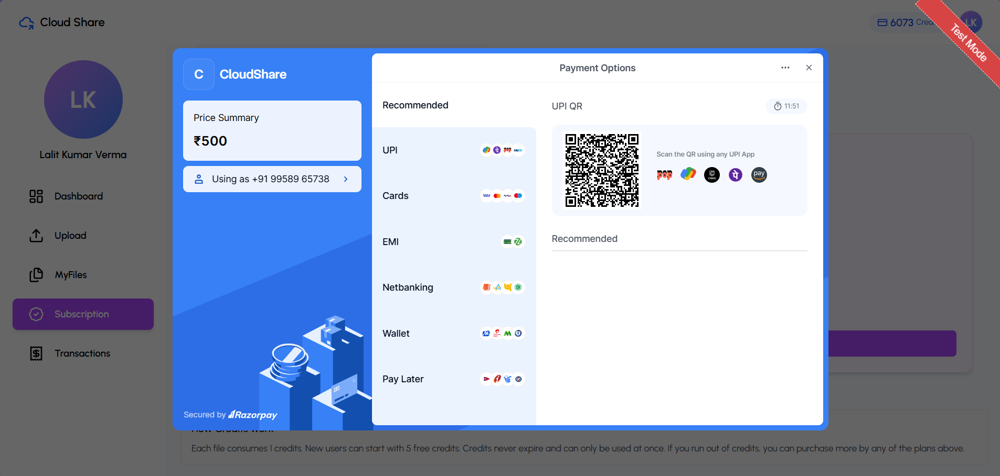
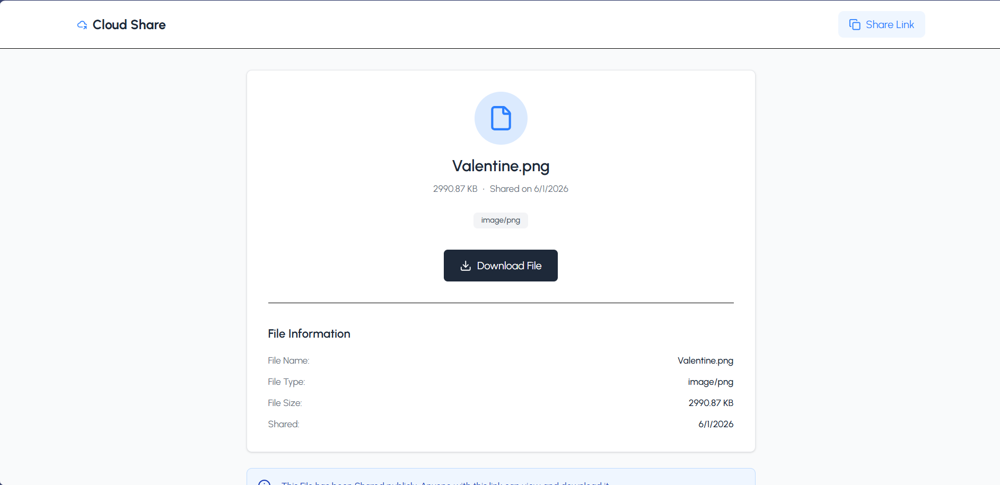

# ☁️ CloudShare-frontend

CloudShare Frontend is a **modern, responsive file-sharing web application** built using **React**.  
It works seamlessly with the CloudShare backend to allow users to **upload, manage, share files**, and **purchase credits securely**.

---

## 🚀 Features

- 🔐 JWT-based Authentication
- 📁 Secure File Upload & Download
- 💳 Credit-based Upload System (Razorpay)
- 🔗 File Sharing with Access Control
- 📊 User Dashboard
- ⚡ Axios with Interceptors
- 🎨 Responsive & Clean UI

---

## 🖼️ Application Screenshots

### 🔐 Authentication


### 📊 Dashboard


### 📁 File Upload & Management
| Upload Files | My Files |
|-------------|----------|
|  |  |

### 💳 Credit & Payment


### 🔗 File Sharing


---

## 🛠️ Tech Stack

- **React**
- **JavaScript (ES6+)**
- **HTML5**
- **CSS3**
- **Axios**
- **JWT Authentication**

---

## 📂 Project Structure

```text
src/
 ├── components     # Reusable UI components
 ├── pages          # Application pages
 ├── services       # API layer (Axios)
 ├── contexts       # Auth & global state
 ├── assets         # Images & icons
 ├── utils          # Helper functions
 └── App.js         # App entry point
